# Kiln Control Structure Diagram

```mermaid
graph TB
    subgraph "Environment (outside system boundary)"
        HOST["CTRL-HOST<br/>Host Application / Gale Task"]
        MELD["Meld (build-time)"]
        SYNTH["Synth (AOT compile)"]
        HW["Hardware / Platform"]
    end

    subgraph "Kiln System Boundary"
        subgraph "Frontend"
            DECODER["CTRL-DECODER<br/>Module/Component Decoder<br/><i>kiln-decoder</i>"]
            LINKER["CTRL-LINKER<br/>Component Linker<br/><i>kiln-component</i>"]
        end

        subgraph "Execution Core"
            ENGINE["CTRL-ENGINE<br/>Execution Engine<br/><i>kiln-runtime</i>"]
            CFI["CTRL-CFI<br/>CFI Engine<br/><i>kiln-runtime/cfi</i>"]
            CM["CTRL-CM<br/>Component Model<br/><i>kiln-component</i>"]
        end

        subgraph "Host Services"
            WASI["CTRL-WASI<br/>WASI Dispatcher<br/><i>kiln-wasi</i>"]
            BLAST["CTRL-BLAST<br/>Blast Zone<br/><i>kiln-component</i>"]
        end

        subgraph "Foundation"
            ALLOC["CTRL-ALLOC<br/>Allocation Manager<br/><i>kiln-foundation</i>"]
        end

        subgraph "Controlled Processes"
            INST["PROC-INSTRUCTION"]
            MEM["PROC-MEMORY"]
            STACK["PROC-STACK"]
            MOD["PROC-MODULE"]
            INSTANCE["PROC-INSTANCE"]
            CANON["PROC-CANONICAL"]
            RES["PROC-RESOURCE"]
            SHADOW["PROC-SHADOW"]
            IO["PROC-IO"]
            BUDGET["PROC-BUDGET"]
        end
    end

    %% Host → System
    HOST -->|"CA-HOST-1: Create engine"| ENGINE
    HOST -->|"CA-HOST-2: Load module"| DECODER
    HOST -->|"CA-HOST-3: Define imports"| LINKER
    HOST -->|"CA-HOST-4: Call export"| ENGINE

    %% External tools (environment)
    MELD -.->|"Fused core module"| HOST
    SYNTH -.->|"AOT binary"| HOST

    %% Frontend → Execution
    DECODER -->|"CA-DEC-1: Parse"| MOD
    DECODER -->|"CA-DEC-3: Detect format"| MOD
    LINKER -->|"CA-LINK-1: Resolve"| INSTANCE
    LINKER -->|"CA-LINK-2: Instantiate"| INSTANCE

    %% Execution Core
    ENGINE -->|"CA-ENG-1: Dispatch"| INST
    ENGINE -->|"CA-ENG-2: Load/Store"| MEM
    ENGINE -->|"CA-ENG-3: Push/Pop"| STACK
    ENGINE -->|"CA-ENG-4: Validate CF"| CFI
    ENGINE -->|"CA-ENG-5: Cross-component"| CM

    %% CFI
    CFI -->|"CA-CFI-1: Push return"| SHADOW
    CFI -->|"CA-CFI-2: Validate return"| SHADOW

    %% Component Model
    CM -->|"CA-CM-1: Lift"| CANON
    CM -->|"CA-CM-2: Lower"| CANON
    CM -->|"CA-CM-3: Resource op"| RES
    CM -->|"CA-CM-6: Isolate fault"| BLAST

    %% WASI
    WASI -->|"CA-WASI-1: FS op"| IO
    WASI -->|"CA-WASI-2: Clock/Random"| IO

    %% Allocation
    ALLOC -->|"CA-ALLOC-1: Allocate"| BUDGET

    %% Feedback (dashed)
    ENGINE -.->|"Result/Trap"| HOST
    INST -.->|"Result"| ENGINE
    MEM -.->|"Value/OOB"| ENGINE
    SHADOW -.->|"Pass/Fail"| CFI
    CFI -.->|"Violation"| ENGINE
    CANON -.->|"Values/Error"| CM
    CM -.->|"Call result"| ENGINE
    IO -.->|"Result/Denial"| WASI
    BUDGET -.->|"Success/Failure"| ALLOC

    %% Cross-toolchain boundary (XH-1 through XH-5)
    CM -.->|"XH-1: Element sizes"| MELD
    CM -.->|"XH-3: Element sizes"| SYNTH
```

## Controller Summary

| Controller | Crate | Control Actions | UCAs | Constraints |
|-----------|-------|----------------|------|-------------|
| CTRL-HOST | (external) | 5 | - | - |
| CTRL-ENGINE | kiln-runtime | 5 | 6 | 6 |
| CTRL-DECODER | kiln-decoder | 3 | 3 | 3 |
| CTRL-LINKER | kiln-component | 3 | 3 | 3 |
| CTRL-CM | kiln-component | 6 | 8 | 8 |
| CTRL-CFI | kiln-runtime | 3 | 3 | 3 |
| CTRL-WASI | kiln-wasi | 3 | 3 | 3 |
| CTRL-BLAST | kiln-component | 2 | 1 | 1 |
| CTRL-ALLOC | kiln-foundation | 2 | 2 | 2 |

## Cross-Toolchain Boundaries

The dotted lines from CTRL-CM to Meld and Synth represent cross-toolchain
consistency hazards (XH-1 through XH-5). These are not control actions but
rather constraints that must be satisfied across independent tool
implementations.
